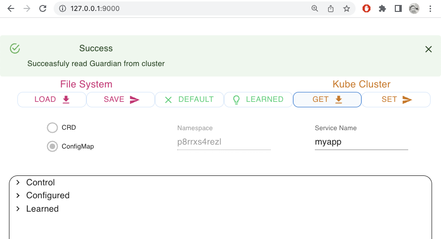
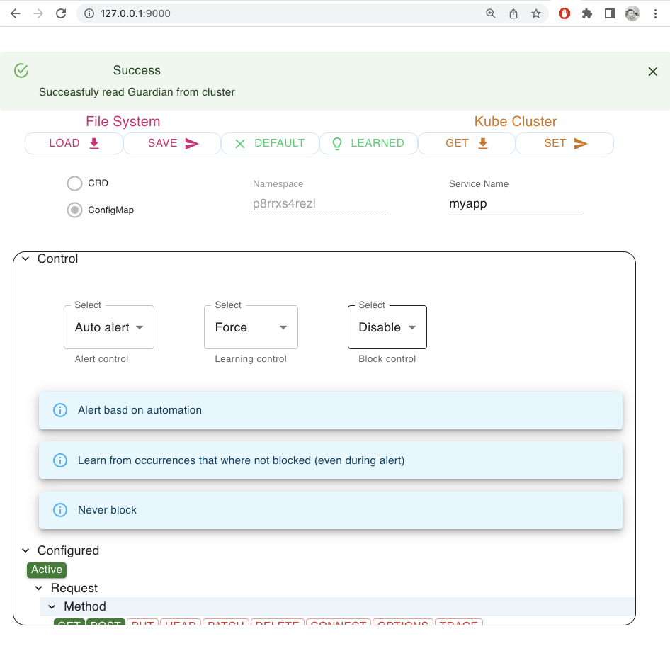
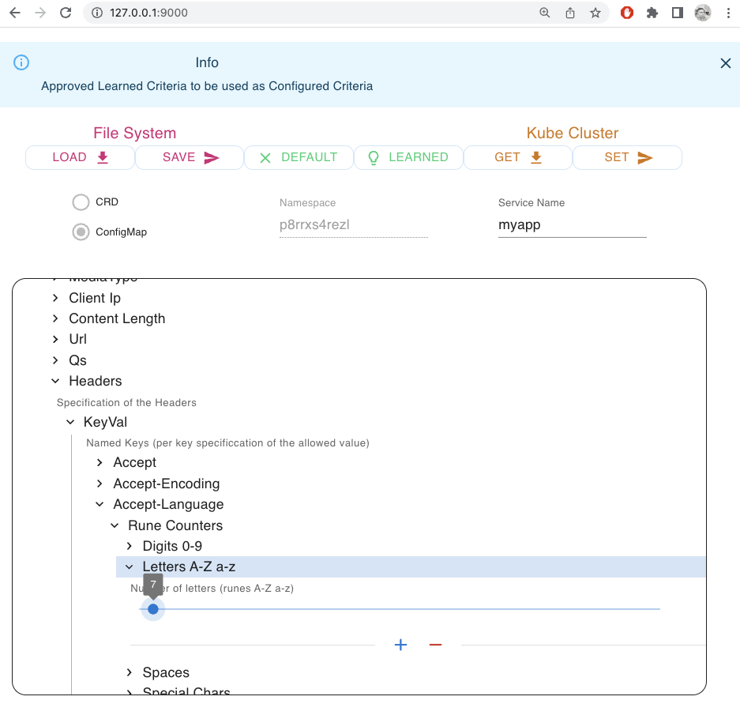

---

copyright:
  years: 2022
lastupdated: "2022-08-02"

keywords: security, zero trust, runtime security, workload security, situational awareness, serverless security, Guard, code engine application security, code engine security

subcollection: codeengine

content-type: tutorial
completion-time: 5m 

---

{{site.data.keyword.attribute-definition-list}}

# Controlling Guard micro-rules using Guard-ui
{: #runtimesecuritytut}
{: toc-content-type="tutorial"}
{: toc-completion-time="5m"}

Guard-ui is a user interface that helps visualize and control Guard micro rules.  See [getting started with Guard](./getting-started-with-guard) for more details about Guard. 
Guard keeps a per service set of micro rules, named a "Guardian", for each application. 
In Code Engine, Guardians are kept in Comfigmaps named "guardian-<SERVICE_NAME>".
By default, a Guardian with a set of micro-rules is auto-learned. 

Guard-ui enabled:
 - Changing Guard to work in a defferent mode of operation
 - Creating and managing a manual configuration of the micro-ruels 
 
Note that editing the Guardian Comnfigmap can achieve the same results. 
Guard-ui is a convinient tool to help users control the Guardian Configmap.
{: shortdesc}

In this tutorial we use Guardian-ui to change the Guardian of a the helloworld application to better suite security needs common in a production environment.

Before you begin:

- Deploy the Guard protected helloworld example by  [following  the steps in the tutorial](./getting-started-with-guard).
- Ensure that docker cli is installed on your workstation
- Ensure that docker services are deployed and enabled on your workstation


All {{site.data.keyword.codeengineshort}} users are required to have a Pay-as-you-Go account. Tutorials might incur costs. Use the Cost Estimator to generate a cost estimate based on your projected usage. For more information, see [{{site.data.keyword.codeengineshort}} pricing](/docs/codeengine?topic=codeengine-pricing).
{: note}

Steps


1. Deploying and starting Guard-ui on your local docker service
2. Accessing Guard-ui from your browser

## Deploy and start guard-ui on your local workstation
{: #deploy-guard-ui}
{: step}

Guard-ui is service that auto-learns the necessery micro-rules for each Guard-protected application in a project. It is helpful to streamline the deployment of new applications that seek Guard protection.   

- Pulling the a guard-ui image

    ```txt
    docker pull ghcr.io/ibm/workload-security-guard/guard-ui
    ```
    {: pre}

    Example output

    ```txt
    Using default tag: latest
    latest: Pulling from ibm/workload-security-guard/guard-ui
    213ec9aee27d: Already exists 
    58494a68472b: Pull complete 
    7ade3c1e8040: Pull complete 
    [...]
    Digest: sha256:cbca82bf0825be4d8f7f7da12e94994d3e9cc818670ab4b697cf3c134ca65744
    Status: Downloaded newer image for ghcr.io/ibm/workload-security-guard/guard-ui:latest
    ghcr.io/ibm/workload-security-guard/guard-ui:latest
    ```
    {: screen}
    
- Starting a shell in a local guard-ui container 

    ```txt
    docker run -p 127.0.0.1:9000:9000  -it ghcr.io/ibm/workload-security-guard/guard-ui sh
    ```
    {: pre}

    Example output

    ```txt
    / # 
    ```
    {: screen}

- Login to the ibm cloud using your credentials
  Note that how you login depend on your login method.

    ```txt
    docker run -p 127.0.0.1:9000:9000  -it ghcr.io/ibm/workload-security-guard/guard-ui sh
    ```
    {: pre}

    Example output

    ```txt
    / # ibmcloud login
    API endpoint: https://cloud.ibm.com

    Email> ...
    ```
    {: screen}

- Start guid-ui against your Code Engine project by typing `start <Project Name>`

    ```txt
    start tests
    ```
    {: pre}

    Example output

    ```txt
    / # start tests
    Selecting project 'tests'...
    Added context for 'tests' to the current kubeconfig file.
    OK
    Starting Guard UI for project: tests (namespace: p8rrxs4rezl)
    Guardian App v0.01
    Serving frontend from path: /frontend
    Setup Namespace: p8rrxs4rezl
    Setup UseConfigmap: true
    Setup LockConfigmap: true
    Setup LockNamespace: true
    Services on port 9000
    ```
    {: screen}


Notes:
* You may choose a different host port if port 9000 is busy on your workstation. E.g. using -p 127.0.0.1:7600:9000 will open the guard-ui in port 7600
* When the login expires, repeat the process to renew your login credentials 


## Browse to the local guard-ui guardian management app that your deployed
{: #guard-browse to guard-ui}
{: step}

Using your browser browse to the url: `http://127.0.0.1:9000/`

1. Type in the <SERVICE_NAME> and press the `Get` button



2. Buttens in the main menue:
  - `Load`: load a guardian from a file in the workstation file system
  - `Save`: save the current guardian to a file in the workstation file system
  - `Default`: create a default (empty) guardian
  - `Learned`: copy the `Learnd>` micro-rules to the `Configured` in the current guardian
  - `Get`: Get the guardian Configmap named `guardian-<Service Name>` in the current `Namespace` from Kube API
  - `Set`: Set the current guardian to a Configmap named `guardian-<Service Name>` of the current `Namespace` using Kube API


3. Under ***Control*** you can select:
  - Using the Alert Control menu:
    - `Control>Alert Control>No Alerts`: get no alerts
    - `Control>Alert Control>Manual Alert`: get alerts based on the manual configuration
    - `Control>Alert Control>Auto Alert`: get alerts based on the auto-learning (the default in Code Engine)
  - Using the Learning Control menu:
    - `Control>Learning Control>Disable`: Stop learning new samples.
    - `Control>Learning Control>Enable`: Learn new samples only if they are not producing alerts
    - `Control>Learning Control>Force`: Learn new samples even if they are producing alerts
  - Using the Block Control menu:
    - `Control>Block Control>Disable`: Never block requests and responses
    - `Control>Block Control>Enable`: Block requests and responses if alert is identified



4. Under ***Configured*** you can find configrable micro-rules that you may manually set
  - First set the ***Control*** to use `Control>Alert Control>Manual Alert` for the manual configuration to be used
  - Then set the `Configured>Active` button to green for the manual configuration to be active
  - Now set the micro-rules manualy as shown below. 
  - It is recommended to copy the learned micro-rules before starting to edir the manual micro-rules by pressing the `Learned` button at the main menu.
    

